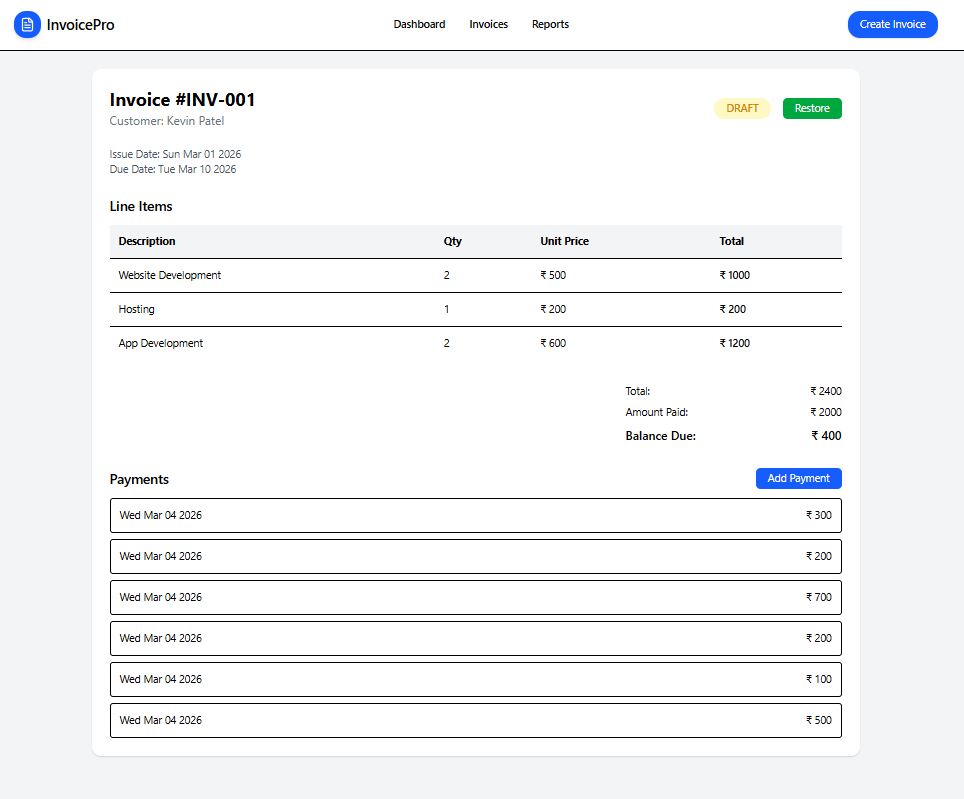

# 🧾 Invoice Details Module

A simple Full Stack Invoice Details system built using the MERN stack.

This project includes backend APIs, database models, and a clean frontend UI for viewing invoice details, managing payments, and archiving invoices.

---

## 🚀 Tech Stack

### Backend

* Node.js
* Express.js
* MongoDB
* Mongoose

### Frontend

* React (Vite)
* Tailwind CSS
* Axios
* React Router

---

# 📂 Project Structure

```
invoice-app/
  ├── backend/
  └── frontend/
```

---

# 🗄️ Database Models

### 1️⃣ Invoice

* invoiceNumber
* customerName
* issueDate
* dueDate
* isArchived

### 2️⃣ InvoiceLine

* invoiceId
* description
* quantity
* unitPrice
* lineTotal (auto calculated)

### 3️⃣ Payment

* invoiceId
* amount
* paymentDate

---

# ⚙️ Backend Setup

## 1️⃣ Navigate to backend

```
cd backend
```

## 2️⃣ Install dependencies

```
npm install
```

## 3️⃣ Create .env file

```
PORT=8080
MONGO_URI="mongoDb URI"
```

## 4️⃣ Run backend

```
npm run dev
```

Server runs on:

```
http://localhost:8080
```

---

# 📡 Backend APIs

### 🔹 Create Invoice (Supporting API)

POST `/api/invoices/create`

### 🔹 Add Line Item (Supporting API)

POST `/api/invoices/:id`

### 🔹 Get Invoice Details

GET `/api/invoices/:id`

Returns:

* Invoice details
* Line items
* Payments
* total (calculated)
* amountPaid (calculated)
* balanceDue (calculated)
* status (PAID or DRAFT)

### 🔹 Add Payment

POST `/api/invoices/payments/:id`

Rules:

* amount > 0
* amount must not exceed remaining balance

### 🔹 Archive Invoice

POST `/api/invoices/archive`

### 🔹 Restore Invoice

POST `/api/invoices/restore`

---

# 🎨 Frontend Setup

## 1️⃣ Navigate to frontend

```
cd frontend
```

## 2️⃣ Install dependencies

```
npm install
```

## 3️⃣ Run frontend

```
npm run dev
```

Frontend runs on:

```
http://localhost:5173
```

---

# 🖥️ Invoice Page Route

```
/invoices/:id
```

The page includes:

* Header with invoice details
* Status badge
* Line items table
* Totals section
* Payments list
* Add Payment modal
* Archive / Restore functionality

---

# 🧠 Business Logic

* lineTotal = quantity × unitPrice
* total = sum of all line totals
* amountPaid = sum of payments
* balanceDue = total - amountPaid
* Overpayment is not allowed
* If balanceDue = 0 → status = PAID

---

# 🧪 How to Test

1. Create invoice using API
2. Add line items
3. Open frontend route with invoice ID
4. Add payment
5. Test overpayment validation
6. Archive / Restore invoice

---

# ✨ Notes

* Financial totals are derived dynamically (not stored in database)
* Clean separation between backend and frontend
* Modular component structure in frontend

---

# 📌 Author

Built as a Full Stack Assignment task.

---

If you face any issue running the project, feel free to check environment variables and MongoDB connection.

